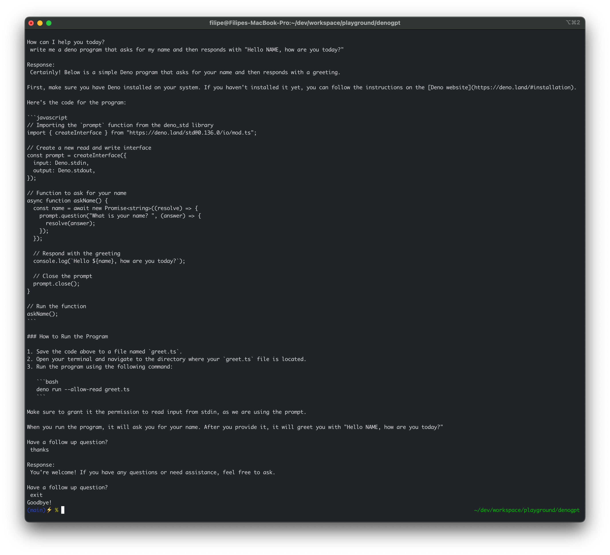

# denoGPT
Simple play around with [Deno 2.1](https://deno.com/) &amp; [OpenAI](https://platform.openai.com/docs/overview)


## Setup
### Install Deno
```bash
curl -fsSL https://deno.land/install.sh | sh
```

### Environment variables

```bash
cp .env.sample .env
```
Edit the `.env` file with your own `OPENAI_API_KEY`.


## Development

```bash
deno task denoGPT
```

## Production

```bash
deno compile -REN denoGPT.ts
```
